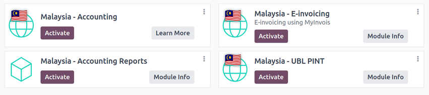

========
Malaysia
========

Configuration
=============

Modules installation
--------------------

:ref:`Install <general/install>` the following modules to get the latest features of the Malaysia
 localization:

.. list-table::
   :header-rows: 1

   * - Name
     - Technical name
     - Description
   * - :guilabel:`Malaysia - Accounting`
     - `l10n_my`
     - Default :ref:`fiscal localization package <fiscal_localizations/packages>`.
   * - :guilabel:`Malaysia - Accounting Reports`
     - `l10n_my_reports`
     - Accounting reports for Malaysia.
   * - :guilabel:`Malaysia - UBL PINT`
     - `l10n_my_ubl_pint`
     - This module includes the features required for export of invoices in PINT format.
   * - :guilabel:`Malaysia - E-invoicing`
     - `l10n_my_edi`
     - This module includes the features required for integration with MyInvois under IRBM.

.. note::
   When **Malaysia** is selected for a company's :guilabel:`Fiscal Localization`, Odoo automatically
   installs certain modules.

Configure your company
----------------------

To configure the company information, go to the :menuselection:`Contacts` app and search the name
given to your company.

#. Select the :guilabel:`Company` option at the top of the page. Then, configure the following fields:

   - :guilabel:`Name`
   - :guilabel:`Address`: add :guilabel:`City`, :guilabel:`State`, :guilabel:`Zip Code`,
     :guilabel:`Country`

     - | In the :guilabel:`Street` field, enter the street name, number, and any additional address
        information.
     - In the :guilabel:`Street 2` field, enter the neighborhood.

   - :guilabel:`Tax ID`: The tax identificaiton number
   - :guilabel:`SST`: Malaysian Sales and Service Tax Number - add if applicable
   - :guilabel:`TTx`: Malaysian Tourism Tax Number - add if applicable

   .. image:: malaysia/company-configuration.png
      :alt: Company configuration.

#. Upload a company logo and :guilabel:`Save` the contact.

E-invoicing integration with MyInvois
=====================================

MyInvois Portal is a platform provided by :abbr:`IRBM (The Inland Revenue Board of Malaysia)`
to facilitate the implementation of e-invoice for the taxpayers of Malaysia.

Odoo supports integration with :guilabel:`MyInvois platform` to submit the invoices generated on Odoo.

.. important::
   - | :guilabel:`Malaysia - E-invoicing module` must be installed in order to submit invoices to
      :guilabel:`MyInvois platform`.

Set-up
------

MyInvois registration
~~~~~~~~~~~~~~~~~~~~~

Before use, the company must register and log-in on the :guilabel:`MyInvois` portal to grant Odoo the
**right to invoice** as an intermediary.

.. _MyTax: https://mytax.hasil.gov.my

#. Access the :guilabel:`MyInvois portal` by loggin in to MyTax_ .

   .. image:: malaysia/mytax.png
      :alt: Mytax page

   .. note::
      If there was no prior instance of logging in, please refer to :guilabel:`User Maual` in MyTax
      Portal.
      Both the **Pre-production** and **Production** environment are supported

#. From the :guilabel:`dashboard`, go to :guilabel:`View Taxpayer Profile`

   .. image:: malaysia/myinvois-profile.png
      :alt: MyInvois profile

#. Under :guilabel:`Representatives` section, click :guilabel:`Add Intermediary`.

   .. image:: malaysia/myinvois-add-intermediary.png
      :alt: MyInvois add intermediary

#. Add **ODOO S.A.** as an intermediary using following information.

   - :guilabel:`TIN`: C57800417080
   - :guilabel:`BRN`: BE0477472701
   - :guilabel:`Name`: ODOO S.A.

   .. image:: malaysia/myinvois-intermediaries.png
      :alt: MyInvois intermediary

#. Ensure below necessary rights are granted.

   - :guilabel:`Reperesntation From`: **Must**
   - :guilabel:`Representation To`: Not a must
   - :guilabel:`Document - Submit`: **Must**
   - :guilabel:`Document - Cancel`: **Must**
   - :guilabel:`Document - Request Rejection`: **Must**
   - :guilabel:`Notifications - View`: Not a must

   .. image:: malaysia/myinvois-rights.png
      :alt: MyInvois rights

   .. note::
      Access is available to revoke in the future if needed.
      No invoice sent on behalf is stored on the proxy server by Odoo as an intermediary.

#. Click :guilabel:`Save` and if successful, **ODOO S.A.** is added as an intermediary with :guilabel:`Status`
   as :guilabel:`Active`.

   .. image:: malaysia/myinvois-intermediary-active.png
      :alt: MyInvois status active

Configuration in Odoo
~~~~~~~~~~~~~~~~~~~~~

Accounting
**********

Go to :menuselection:`Accounting --> Configuration --> Settings --> Malaysian Electronic Invoicing`.

Depending on the selected **User environment** to access MyIvnois, choose the relevant **Invoice Mode**.
After checking the :guilabel:`TIN`, click :guilabel:`Register`.

   .. image:: malaysia/e-invoicing-configuration.png
      :alt: Accounting configuration

.. note::
   Make sure to check TIN before clicking register. To change the TIN, click :guilabel:`Unregister` and
   :guilabel:`Register` again after changing on the company contact. This also needs to match with the
   number registered on **MyInvois** portal.

Contact & Company Information
*****************************

During the initial stage of set-up, go to the :menuselection:`Setting --> Companies --> Update Info` and
fill in the below information. For the **new contacts** created, ensure to fill in the information below as well
to allow sending of invoices to the contacts.

- Country
- State
- Tax ID
- Phone Number
- SST
- E-invoicing
   - Identification
   - Ind. Classification: Only for the company information

   .. image:: malaysia/e-invoicing-contact.png
   .. image:: malaysia/e-invoicing-company-classification.png

.. important::
   For :guilabel:`Identification`, ensure to fill in the right identification method and number that was
   used during the registration on the platform.

Products
********

All the propducts to include on e-invoicing requires :guilabel:`Malaysian classification code` defined.

   .. image:: malaysia/e-invoicing-product.png
      :alt: Product configuration

Workflow
--------

Send invoice to MyInvois
~~~~~~~~~~~~~~~~~~~~~~~~

Once an invoice is confirmed in the system, they are available for sending to MyInvois platform.

Single Invoice
**************

#. Click :guilabel:`Send & Print`.

   .. image:: malaysia/e-invoicing-send-single.png
      :alt: Send single invoice

#. Choose :guilabel:`Send to MyInvois` and click :guilabel:`Send & Print`.

   .. image:: malaysia/e-invoicing-send-v17.png
      :alt: Send to MyInvois

Multiple invoices
*****************

#. In the Accounting App, go to :menuselection:`Customers --> Invoices`.
#. Use a checkbox on the left to select the invoices to send.
#. After selection is completed,  click :guilabel:`Print & Send` button.

   .. image:: malaysia/e-invoicing-send-multiple.png
      :alt: Send multiple invoices

   .. note::
      Instead of sending multiple invoices one by one, the method above to send multiple invoices at once is
      the recommended method to reduce the traffic casued by requests.

#. Check sending the method, then click :guilabel:`Print & Send`.

Return result
*************

- | Upon successful submission, :guilabel:`MyInvois State` is updated to :guilabel:`Valid` upon receiving the
   feed from MyInvois. The same information sent and returned is accessible on the MyInvois Portal.

   .. image:: malaysia/myinvois-submitted.png
      :alt: Submitted result

- | Additional information including :guilabel:`Submission UID`, :guilabel:`MyInvois` and :guilabel:`Validation Time`
   are updated on the :guilabel:`MyIvnois` tab of the invoice and on the :guilabel:`Chatterbox`.

   .. image:: malaysia/e-invoicing-result.png
      :alt: Return result

   .. image:: malaysia/e-invoicing-result-chatterbox.png
      :alt: Return result chatterbox

.. note::
   If no feed was received from MyInvois, the status will be **In Progress**.
   Odoo will automatically check and update the status usinhg scheduled action.

Invoice cancellation
~~~~~~~~~~~~~~~~~~~~

Invoice sent is available for cancellation within 72 hours from the :guilabel:`Validation time`.

#. Click :guilabel:`Request Cancel`.

   .. image:: malaysia/e-invoicing-cancel.png
      :alt: Cancel invoice

#. Include the :guilabel:`Reason` and click :guilabel:`Update Invoice`.

   .. image:: malaysia/e-invoicing-cancel-reason.png
      :alt: Cancel invoice reason

.. note::
   Upon successful cancellation, :guilabel:`MyInvois State` is updated to :guilabel:`cancelled`.
